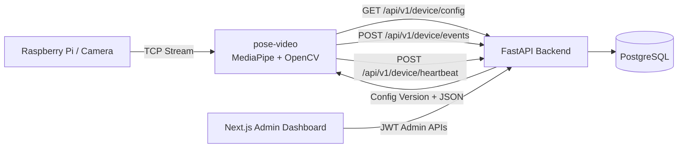
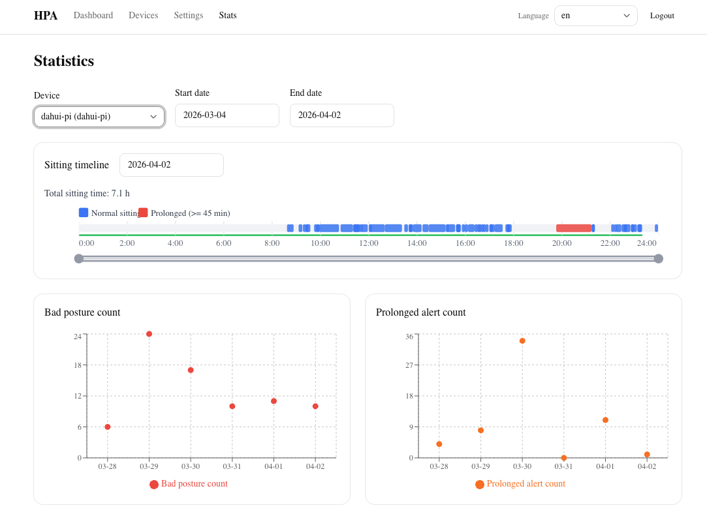
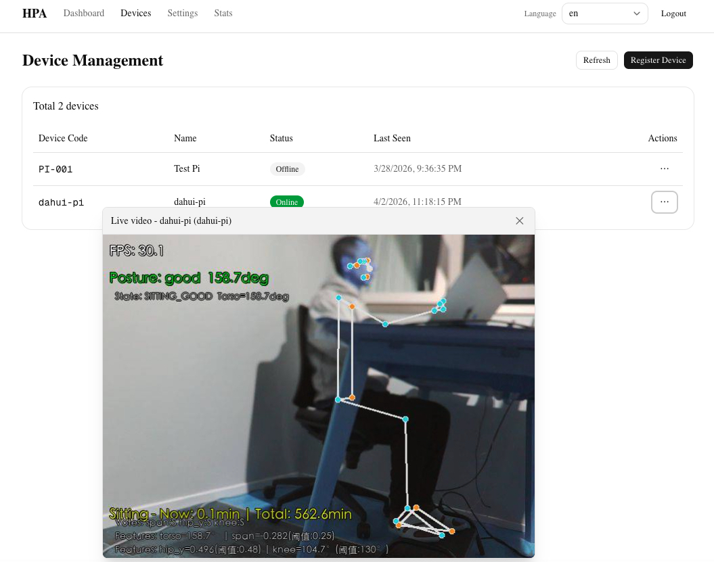
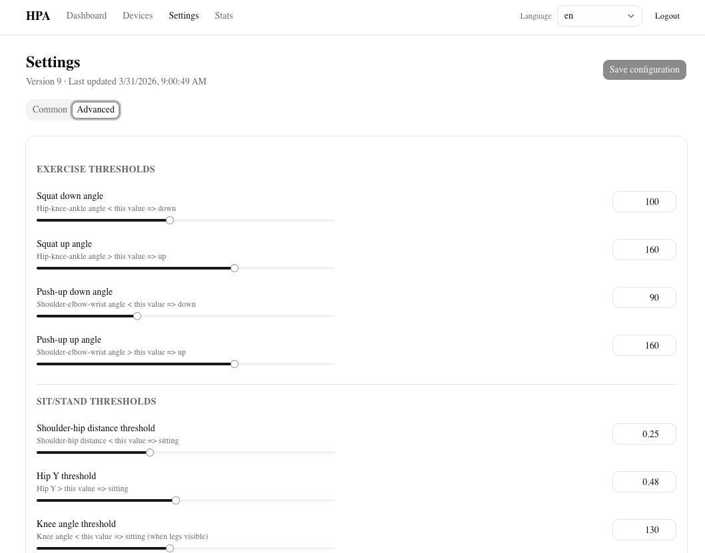
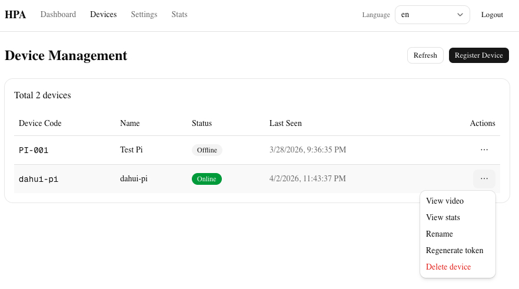

# Health Video Assistant

[](#tech-stack)
[](#tech-stack)
[](#tech-stack)
[](#tech-stack)
[](#run-modes)

Health Video Assistant is a full-stack system for posture and sedentary-health assistance:
- Real-time posture analysis on edge devices (camera / Raspberry Pi stream)
- A web admin platform for device management, config delivery, and analytics
- Backend APIs for event ingestion, heartbeats, and centralized configuration

Chinese version: [README_zh.md](README_zh.md)

## Why This Project

Many people sit for long hours without noticing posture degradation. This project focuses on a practical loop:
1. Detect posture problems in real time on the edge client.
2. Trigger reminders and collect posture events.
3. Analyze trends in a web dashboard and tune device behavior via config.

## Key Features

- Real-time sitting/slouching detection with sedentary reminders
- Edge-cloud decoupling: offline/local mode and connected mode both supported
- Runtime config sync from backend (no edge restart required)
- Device heartbeat and event reporting pipeline
- Admin portal for devices, profile settings, and statistics

## System Architecture

```text
Raspberry Pi / Camera
  |
  | TCP stream
  v
pose-video (MediaPipe/OpenCV)
  |
  | REST: config pull + events + heartbeat
  v
FastAPI backend + PostgreSQL
  |
  | API
  v
Next.js admin dashboard
```



## Screenshots

The gallery below is wired for real project screenshots. Place your images at these paths and they will render automatically on GitHub:

| Page | Preview |
|---|---|
| Dashboard / Stats |  |
| Edge Pose Detection |  |
| Settings / Parameters |  |
| Device Management |  |

## Tech Stack

### Edge CV (pose-video)

- Python 3.11+
- OpenCV, MediaPipe, NumPy, Pillow
- Optional TensorFlow Lite (MoveNet-related scripts)

### Platform (health_pose_assistant_website)

- Backend: FastAPI, SQLAlchemy, Alembic, PostgreSQL
- Frontend: Next.js (App Router), React, TypeScript, Tailwind
- Dev setup: Docker Compose + local scripts

## Repository Structure

```text
health-video-assistant/
├── pose-video/
│   ├── pose_detect_mediapipe.py
│   ├── config_client.py
│   ├── video_on_pi/pi_stream.py
│   └── requirements.txt
└── health_pose_assistant_website/
    ├── backend/
    ├── frontend/
    ├── scripts/
    ├── docker-compose.yml
    └── start_dev_backend.sh
```

## Quick Start

### 1) Start the web platform first

```bash
cd health_pose_assistant_website
bash scripts/setup_dev.sh
./start_dev_backend.sh
```

Default URLs:
- Frontend: http://localhost:3000
- Backend: http://localhost:8000
- API docs: http://localhost:8000/docs

### 2) Start the edge posture client

```bash
cd pose-video
python3.11 -m venv .venv
source .venv/bin/activate
pip install -r requirements.txt

# Local camera mode
python3 pose_detect_mediapipe.py --source 0

# Pi streaming mode (default TCP 9999)
python3 pose_detect_mediapipe.py
```

### 3) Connect edge client to backend (optional)

```bash
python3 pose_detect_mediapipe.py \
  --api-url http://localhost:8000 \
  --device-token <YOUR_DEVICE_TOKEN>
```

Connected mode enables:
- Config polling (default every 10 seconds)
- Event upload + heartbeat
- Optional MJPEG output (default port 8080)

## Run Modes

### Local development

- Host PostgreSQL + Python venv + Node.js workflow
- Best for fast iteration and algorithm/backend/frontend integration

### Docker Compose (web platform)

Run from health_pose_assistant_website:

```bash
cp .env.example .env
cp frontend/.env.example frontend/.env  # if present
docker compose up --build
```

## Demo Checklist

For a clean demo flow on GitHub or in a meeting:
1. Register a device in admin panel and get device token.
2. Run edge client with api-url + device-token.
3. Trigger posture events by simulating sitting/slouching.
4. Verify events and trends in admin stats page.

## Development Notes

- Validate this path first: device registration -> token -> edge reporting -> dashboard visibility
- Start with default thresholds; calibrate by backend config after initial baseline
- Keep event schema backward-compatible when adding new detection logic

## Roadmap

- [ ] Expand posture and activity categories
- [ ] Improve analytics granularity and trend exploration
- [ ] Add multi-user and multi-device team management
- [ ] Harden production deployment and monitoring workflows

## Contributing

Contributions are welcome. Open an issue first for major changes so implementation direction can be aligned.

## License

No license is declared yet. If open-sourcing, add a LICENSE file (for example, MIT).
