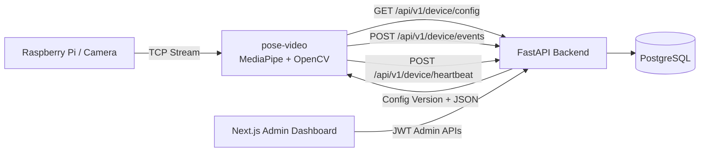

# Health Video Assistant

[](#技术栈)
[](#技术栈)
[](#技术栈)
[](#技术栈)
[](#运行方式)

English: [README.md](README.md)

一个用于健康姿态辅助的全栈项目：
- 端侧（摄像头/树莓派）实时姿态检测与久坐提醒
- Web 管理后台进行设备管理、配置下发与统计查看
- 后端 API 统一接收设备事件与心跳

## 为什么做这个项目

很多人会在长时间久坐时不自觉地出现姿态退化。这个项目聚焦一个可落地的闭环：
1. 在端侧实时识别姿态问题。
2. 触发提醒并采集姿态事件。
3. 在 Web 看板中分析趋势，并通过配置回传优化设备行为。

## 目录

- [为什么做这个项目](#为什么做这个项目)
- [项目亮点](#项目亮点)
- [系统架构](#系统架构)
- [截图](#截图)
- [技术栈](#技术栈)
- [仓库结构](#仓库结构)
- [快速开始](#快速开始)
- [运行方式](#运行方式)
- [演示清单](#演示清单)
- [开发建议](#开发建议)
- [Roadmap](#roadmap)
- [Contributing](#contributing)
- [License](#license)

## 项目亮点

- 实时姿态检测：支持坐姿/驼背识别、久坐提醒
- 边缘端与云端解耦：端侧可纯本地运行，也可接入后端配置与事件上报
- 设备配置热更新：后端配置可定时拉取并实时生效
- 设备心跳与事件上报：完整的数据采集与可观测链路
- 管理后台：设备管理、配置管理、统计分析

## 系统架构

```text
Raspberry Pi / Camera
  |
  | TCP stream
  v
pose-video (MediaPipe/OpenCV)
  |
  | REST: config pull + events + heartbeat
  v
FastAPI backend + PostgreSQL
  |
  | API
  v
Next.js admin dashboard
```



## 截图

下方画廊已接入仓库路径，按对应位置放入截图后可在 GitHub 自动渲染：

| 页面 | 预览 |
|---|---|
| Dashboard / 统计页 |  |
| 端侧姿态检测 |  |
| 配置参数页 |  |
| 设备管理页 |  |

## 技术栈

### Edge / CV (`pose-video`)

- Python 3.11+
- OpenCV, MediaPipe, NumPy, Pillow
- 可选：TensorFlow Lite（MoveNet 相关脚本）

### Website / Platform (`health_pose_assistant_website`)

- Backend: FastAPI + SQLAlchemy + Alembic + PostgreSQL
- Frontend: Next.js (App Router) + React + TypeScript + Tailwind
- 开发方式: Docker Compose + 本地脚本

## 仓库结构

```text
health-video-assistant/
├── pose-video/                      # 姿态识别端（Mac / Pi 视频流 / 本地摄像头）
│   ├── pose_detect_mediapipe.py     # 主入口（姿态检测 + 提醒 + 可选后端上报）
│   ├── config_client.py             # 配置拉取 + 事件上报客户端
│   ├── video_on_pi/pi_stream.py     # Pi 端视频推流脚本
│   └── requirements.txt
└── health_pose_assistant_website/   # Web 平台（前后端 + 数据库）
    ├── backend/
    ├── frontend/
    ├── scripts/
    ├── docker-compose.yml
    └── start_dev_backend.sh
```

## 快速开始

### 1) 启动 Web 平台（推荐先做）

```bash
cd health_pose_assistant_website
bash scripts/setup_dev.sh
./start_dev_backend.sh
```

启动后默认地址：
- Frontend: http://localhost:3000
- Backend: http://localhost:8000
- API Docs: http://localhost:8000/docs

### 2) 启动姿态识别端

```bash
cd pose-video
python3.11 -m venv .venv
source .venv/bin/activate
pip install -r requirements.txt

# 本地摄像头调试
python3 pose_detect_mediapipe.py --source 0

# 等待 Pi 推流（默认 TCP 9999）
python3 pose_detect_mediapipe.py
```

### 3) 接入后端（可选）

```bash
python3 pose_detect_mediapipe.py \
  --api-url http://localhost:8000 \
  --device-token <YOUR_DEVICE_TOKEN>
```

接入后将启用：
- 配置轮询（默认 10 秒）
- 事件上报与心跳
- 可选 MJPEG 输出（默认端口 8080）

## 运行方式

### 本地开发模式

- Web 平台使用主机 PostgreSQL + Python venv + Node.js
- 适合调试接口、前端页面和算法联调

### Docker Compose 模式（Web 平台）

在 `health_pose_assistant_website` 目录：

```bash
cp .env.example .env
cp frontend/.env.example frontend/.env  # 若存在

docker compose up --build
```

## 演示清单

为了在 GitHub 或会议演示中更顺畅，建议按下面流程走一遍：
1. 在后台注册设备并获取 device token。
2. 使用 api-url + device-token 启动端侧客户端。
3. 通过模拟坐姿/驼背触发姿态事件。
4. 在后台统计页确认事件与趋势变化。

## 开发建议

- 建议先打通最小链路：`设备注册 -> device token -> 端侧事件上报 -> 后台统计可见`
- 端侧参数先用默认值，再通过后台配置逐步校准
- 新增检测逻辑时，优先保持事件模型兼容，避免破坏统计口径

## Roadmap

- [ ] 更完善的姿态类别与动作识别
- [ ] 更细粒度的统计看板与趋势分析
- [ ] 多设备与多用户协同管理
- [ ] 生产环境部署脚本与监控告警完善

## Contributing

欢迎贡献。若是较大改动，建议先提 issue 对齐实现方向。

## License

当前仓库未声明 License。若准备开源发布，建议补充 `LICENSE` 文件（例如 MIT）。
